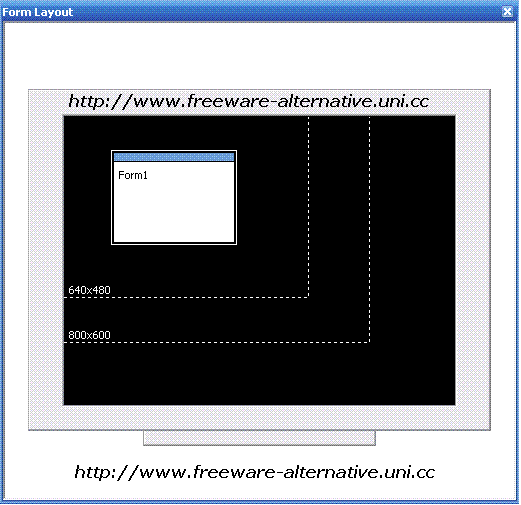

<div align="center">

## AONE  VB6's inbuilt screen Resolution Guides for Resolution Fixing \- NO CODE


</div>

### Description

Make your software RESOLUTION PROOF, there is a very easy to use utility/feture in VB6 ide THAT MANY FEW PROGRAMMERS KNOW. NO CODE AT ALL.
 
### More Info
 


<span>             |<span>
---                |---
**Submitted On**   |
**By**             |[Deepesh Agarwal](https://github.com/Planet-Source-Code/PSCIndex/blob/master/ByAuthor/deepesh-agarwal.md)
**Level**          |Beginner
**User Rating**    |3.4 (37 globes from 11 users)
**Compatibility**  |VB 3\.0, VB 4\.0 \(16\-bit\), VB 4\.0 \(32\-bit\), VB 5\.0, VB 6\.0
**Category**       |[Miscellaneous](https://github.com/Planet-Source-Code/PSCIndex/blob/master/ByCategory/miscellaneous__1-1.md)
**World**          |[Visual Basic](https://github.com/Planet-Source-Code/PSCIndex/blob/master/ByWorld/visual-basic.md)
**Archive File**   |[](https://github.com/Planet-Source-Code/deepesh-agarwal-aone-vb6-s-inbuilt-screen-resolution-guides-for-resolution-fixing-no-code__1-61336/archive/master.zip)


### Source Code

```
Visual Basic 6 provides a monitor icon in the lower right corner of the development environment that shows the position and size of the current form on the screen. You can drag the miniature form icon to change its position, which changes the Top and Left properties accordingly. The virtual screen on this monitor icon has the same pixel resolution as your actual screen.
Many VB programmers aren't aware that you can access two handy tools by right-clicking the icon and selecting from the popup menu. If you select the Resolution Guides command, it will display dotted lines for lower resolutions. For example, my screen is 1280x1024 pixels and I get resolution guides for 1024x768, 800x600, and 640x480. These guides are useful when you want to size and position your forms to work well on the widest possible variety of video hardware. (SEE SCREENSHOT ABOVE)
The other useful command on this menu is Startup Position. By default this is Manual, which means the form displays initially at the position you drag it to during design. Your other choices are Center Screen, Center Owner, and Windows Default.
PLS. DO NOT FORGET TO VOTE.
Deepesh AGarwal.
http://www.freeware-alternative.uni.cc/
```

